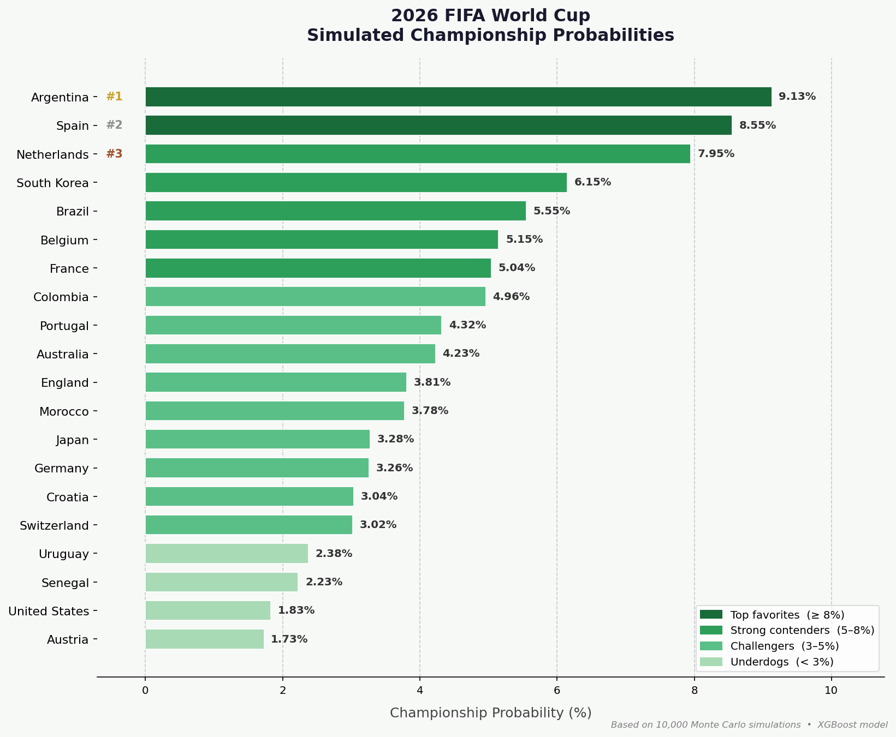

# FIFA World Cup 2026 — ML Outcome Prediction & Monte Carlo Simulation

A full end-to-end machine learning project that predicts match outcomes for the 2026 FIFA World Cup and runs 10,000 Monte Carlo tournament simulations to estimate each team's championship probability.

---

## Results

| Rank | Team | Championship Probability |
|------|------|--------------------------|
| 🥇 1 | Argentina | 9.13% |
| 🥈 2 | Spain | 8.55% |
| 🥉 3 | Netherlands | 7.95% |
| 4 | South Korea | 6.15% |
| 5 | Brazil | 5.55% |
| 6 | Belgium | 5.15% |
| 7 | France | 5.04% |
| 8 | Colombia | 4.96% |
| 9 | Portugal | 4.32% |
| 10 | Australia | 4.23% |



---

## Project Pipeline

The project is organized into 4 phases, each in its own Jupyter notebook:

### Phase 1 — Data Cleaning (`Phase1_Data_Cleaning.ipynb`)
- Loaded `results.csv` (~47,000 historical international matches) and `fifa_ranking-2024-06-20.csv`
- Merged on team name using `pd.merge_asof` to attach the most recent FIFA ranking to each match date
- Applied `former_names.csv` to normalize team name changes (e.g., Zaire → DR Congo)
- Output: `data/processed/results_cleaned.csv` (~29,400 rows, 1993–2024)

### Phase 2 — Exploratory Data Analysis (`Phase2_Exploratory_Data_Analysis.ipynb`)
- Analyzed home advantage, goal distributions, and ranking vs. outcome trends
- Engineered the 7 model features:
  - `rank_diff` = away_ranking − home_ranking
  - `points_diff`, `form_diff_5` (avg goal diff last 5 games)
  - `avg_gf_diff`, `avg_ga_diff`, `win_rate_diff`, `is_neutral`
- Output: `data/processed/modeling_dataset_phase3.csv`

### Phase 3 — ML Models (`Phase3_ML_Models.ipynb`)
- Trained and compared Logistic Regression, Random Forest, and XGBoost
- XGBoost achieved the best accuracy (~57%) — consistent with the difficulty of predicting football outcomes
- Saved best model and artifacts: `outputs/best_model_xgb.pkl`, `outputs/feature_cols.pkl`, `outputs/label_map_inv.pkl`

### Phase 4 — Simulation (`Phase4_Simulations.ipynb`)
- Recovered 8 missing WC teams (South Korea, Iran, etc.) whose data was dropped in Phase 1 due to FIFA naming mismatches — fixed using `merge_asof` with a name-mapping dictionary
- Capped all data at `2024-06-20` for a consistent baseline across all 48 teams
- Implemented `simulate_match`, `simulate_group`, `simulate_knockout_round`, and `simulate_tournament`
- Fixed 3 bugs before running: inverted `rank_diff` sign, wrong feature type for `form_diff_5`, and data cutoff asymmetry
- Ran **10,000 full 48-team tournament simulations** (~39 min)

---

## Repository Structure

```
fifa-worldcup-ml-simulation/
├── data/
│   ├── raw/
│   │   ├── results.csv                   # Historical match results (Kaggle)
│   │   ├── fifa_ranking-2024-06-20.csv   # FIFA rankings as of June 2024
│   │   ├── former_names.csv              # Team name aliases
│   │   ├── goalscorers.csv
│   │   ├── shootouts.csv
│   │   └── wc2026_groups.csv             # 2026 WC group draw (48 teams)
│   └── processed/
│       ├── results_cleaned.csv           # Phase 1 output
│       └── modeling_dataset_phase3.csv   # Phase 2 output
├── notebooks/
│   ├── Phase1_Data_Cleaning.ipynb
│   ├── Phase2_Exploratory_Data_Analysis.ipynb
│   ├── Phase3_ML_Models.ipynb
│   └── Phase4_Simulations.ipynb
├── outputs/
│   ├── best_model_xgb.pkl
│   ├── feature_cols.pkl
│   ├── label_map_inv.pkl
│   └── championship_probabilities.png
├── src/                                  # (reserved for modular scripts)
├── requirements.txt
└── README.md
```

---

## Setup & Running

**Requirements:** Python 3.10+, Anaconda recommended

```bash
pip install -r requirements.txt
```

Run notebooks in order:
1. `Phase1_Data_Cleaning.ipynb`
2. `Phase2_Exploratory_Data_Analysis.ipynb`
3. `Phase3_ML_Models.ipynb`
4. `Phase4_Simulations.ipynb`

> **Note:** Phase 4 simulation cell (~10,000 tournaments) takes approximately 35–40 minutes to run. All outputs are already saved in `outputs/`.

---

## Tech Stack

| Tool | Purpose |
|------|---------|
| Python 3.12 | Core language |
| pandas | Data cleaning & feature engineering |
| scikit-learn | Logistic Regression, Random Forest, model evaluation |
| XGBoost | Best-performing classifier |
| NumPy | Vectorized math, Monte Carlo sampling |
| Matplotlib | Visualization |
| joblib | Model serialization |
| Jupyter Notebook | Interactive development |

---

## Key Findings & Limitations

**Argentina (9.13%)** leads as the simulation's top pick, consistent with their FIFA #1 ranking and strong form in mid-2024. Traditional powerhouses Spain, Netherlands, Brazil, and France all appear in the top 10.

**Limitations:**
- Data is frozen at June 2024 — post-2024 form, injuries, and squad changes are not reflected
- The model uses match-level statistics only; no player-level features (Elo, market value)
- The bracket structure is a simplified approximation of the official 2026 FIFA format

---

*CSCI 490 — Directed Research | Biola University | Spring 2026*